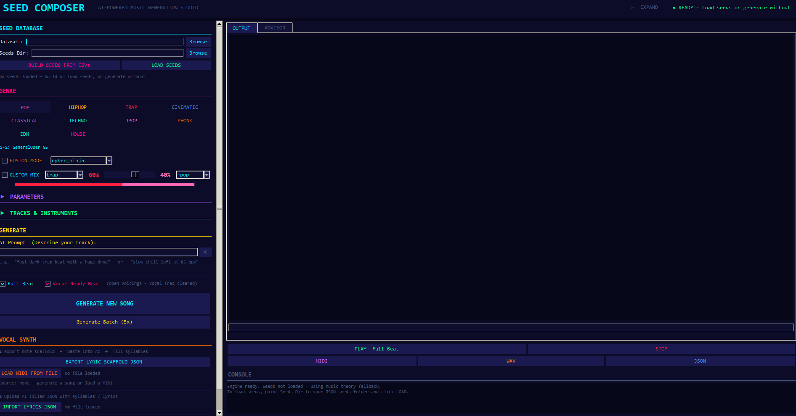

# Music Architect V7

An AI-powered MIDI composition engine that generates full 10-track instrumentals using an **evolutionary fitness loop**. The system evolves beat quality across multiple generations — each generation seeds the next from the top-scoring tracks — until it produces commercially ready music.



---

## What it does

Music Architect V7 generates complete MIDI productions for **11 genres** (Pop, Trap, Hip-Hop, House, EDM, Cinematic, J-Pop, Phonk, Techno, DnB, Classical) through a 3-stage pipeline:

1. **Generate** — Compose 10-track instrumentals (kick, bass, chords, melody, arp, pads, stabs, FX, percussion, intro) using genre-specific cipher rules and humanization.
2. **Grade** — Score each track against a 115-point fitness function covering harmonic correctness, rhythmic density, motif variety, macro-dynamics, and polyrhythmic integrity.
3. **Evolve** — Keep the top 20 % as "golden seeds", mutate them slightly, and use them as the starting point for the next generation.

After 3 generations the best tracks automatically receive a `vocal_ready` sibling — the same arrangement with open chord voicings (root + 5th + octave shell) and the vocal frequency register (C4–C6) cleared in verse, chorus, and hook sections, ready for a vocalist to record over.

---

## Key Features

| Feature | Details |
|---|---|
| **Evolutionary loop** | Gen 1 → Gen 2 → Gen 3, each seeded from top 20 % of the previous |
| **10-track matrix** | Kick · Bass · Chords · Melody · Arp · Pads · Stabs · FX · Percussion · Intro |
| **Dual output mode** | GUI generates both a Full Beat and a Vocal-Ready Beat in a single press — independently selectable via checkboxes; same seed guarantees a perfectly paired set |
| **Vocal-Ready processing** | `vocal_mask=True` applies open chord voicings, clears C4–C6 in melody/arp/bass/texture tracks at verse/chorus/hook sections; mathematically validated in `vocal_mask_math.py` |
| **Multi-SF2 genre routing** | `SoundFontLibrary` auto-discovers installed SF2s and routes each genre to the optimal timbre: Fluid R3 GM (trap/hip-hop/techno/dnb/phonk), GeneralUser GS (pop/j-pop/edm/house), Arachno SF v1.0 (cinematic/classical) |
| **Non-realtime WAV rendering** | FluidSynth renders via `-a null` driver — no speaker output during export, CPU-speed rendering (~15–20 s for a 3-minute song); subprocess is cancellable via the Stop button |
| **SF2 indicator** | Genre selector shows the active soundfont for the current genre in real time |
| **Procedural song structure** | `StructureGenerator` builds a randomised but music-theory-valid section sequence per genre — verse-chorus arches, build-drop duality, J-pop pre-chorus law |
| **Gradual intro orchestration** | `GradualOrchestrationProtocol` layers instruments in one by one at genre-specific thresholds with a velocity ramp — bass, then kick, then hi-hat, then pad |
| **Gradual outro de-orchestration** | `GradualDeOrchestrationProtocol` exits elements in the reverse intro order (Reverse Principle / arch form) with a two-stage velocity fade |
| **Section-aware drum routing** | `DrumPatternArchitect` selects different base patterns for verse vs chorus/drop — guaranteeing audible groove contrast — with a per-song snare variation level (0–3) |
| **8–9 drum patterns per genre** | Each pattern represents a distinct production school with documented music-theory grounding (boom-bap, Dilla, west coast, drill, half-time, rage, bounce, …) |
| **BassArchitect** | Per-song bass instrument + 16-step rhythmic archetype + note palette selection; 17–18 archetypes for Pop, Hip-Hop, Cinematic; isolated RNG per song |
| **BillboardIntroMatrix** | 4 commercially proven intro archetypes: `pedal_point`, `syncopated_anticipation`, `four_chord_loop`, `inverted_filter_sweep` |
| **Harmonic Governor** | Resolves dissonant notes to the nearest scale pitch; configurable per genre |
| **Bright-scale enforcement** | Commercial pipeline locks Pop/House/EDM to Major, Lydian, Mixolydian, Pentatonic Major — zero dark modes |
| **Velocity LSB watermarking** | Hides a per-file cryptographic fingerprint in note velocities (±1 delta, inaudible) |
| **UTAU export** | Melody track exported as `.ustx` for UTAU/OpenUtau vocal synthesis |
| **GUI** | Tkinter interface with AI prompt decoder, live SF2 indicator, dual beat/vocal-ready generation, and FluidSynth WAV preview |

---

## Project Structure

```
music_architect_v7/
├── main.py                        # Entry point — GUI, batch, watermark
├── requirements.txt
├── config/
│   └── harmonic_governor.json     # Scale-correction rules per genre
├── scripts/                       # Standalone utility scripts
│   ├── compare_generations.py
│   ├── inspect_full.py
│   └── ...
├── seeds/
│   └── matrices/                  # Compact golden-matrix JSONs per genre
├── src/
│   ├── composition/               # Core engine — config, cipher, archetypes
│   │   ├── composition_engine.py  # Main CompositionEngine class
│   │   ├── composition_config.py  # CompositionConfig dataclass (vocal_mask flag)
│   │   ├── genre_constants.py     # BPM, scale, drum patterns, instrument maps (11 genres)
│   │   ├── structure_generator.py # Procedural randomised song structure per genre
│   │   ├── bass_architect.py      # Per-song bass archetype + palette selection
│   │   └── billboard/             # Commercially grounded composition modules
│   │       ├── gradual_orchestration.py      # Intro layer entry protocol
│   │       ├── gradual_de_orchestration.py   # Outro reverse-exit protocol
│   │       ├── drum_pattern_architect.py     # Per-section drum pattern routing
│   │       ├── pedal_point.py
│   │       ├── syncopated_anticipation.py
│   │       ├── four_chord_loop.py
│   │       └── inverted_filter_sweep.py
│   ├── generators/                # Per-track note generators (bass, melody, arp, …)
│   ├── orchestration/             # Batch commander + fitness grader
│   ├── pipeline/                  # Batch runners
│   │   ├── omni_render.py         # Evolutionary pipeline (Trap / Hip-Hop)
│   │   └── batch_commercial.py    # Commercial sync pipeline (Pop / House / EDM)
│   ├── tools/
│   │   └── watermark_engine.py    # Dual-layer MIDI watermarking
│   ├── arrangement/               # Genre fusion and smart arrangement
│   ├── rendering/                 # WAV + FluidSynth export
│   │   ├── fluidsynth_renderer.py # Non-realtime FluidSynth renderer with cancel()
│   │   └── soundfont_library.py   # SF2 discovery + genre-based routing (3-font split)
│   ├── ingestion/                 # MIDI seed ingestion and analysis
│   ├── patterns/                  # Euclidean patterns, extractors, generators
│   ├── core/                      # Orchestrator, quantizer, context manager
│   ├── utils/                     # Humanizer, voice-leading, polyrhythm engine
│   │   └── vocal_mask_math.py     # Open voicing + vocal register math (C4–C6)
│   └── gui/                       # Tkinter GUI application
└── tests/
```

---

## Installation

```bash
git clone https://github.com/JulianWIAI/music_architect_v7.git
cd music_architect_v7
pip install -r requirements.txt
```

For audio preview inside the GUI (optional):
```bash
pip install pygame
```

### SoundFonts (optional — required for WAV rendering)

Install [FluidSynth](https://www.fluidsynth.org/) and place SF2 files in `C:\SoundFonts\`. The renderer auto-discovers installed fonts and routes each genre to the best available timbre:

| SoundFont | Genres | License |
|---|---|---|
| `FluidR3_GM.sf2` | Trap · Hip-Hop · Phonk · Techno · DnB | MIT |
| `GeneralUser GS v1.472.sf2` | Pop · J-Pop · EDM · House | Free (S. Christian Collins) |
| `Arachno SoundFont - Version 1.0.sf2` | Cinematic · Classical | Verify before commercial use |

The system falls back to whichever font is available, so partial installations still render audio.

---

## Usage

### GUI
```bash
python main.py
```

Select a genre — the SF2 indicator below the genre buttons shows which soundfont will be used. Check **Full Beat** and/or **Vocal-Ready Beat** before clicking Generate. Both are selected by default, producing a paired MIDI set from the same seed in a single generation pass.

### Evolutionary batch — Trap & Hip-Hop
Runs a 3-generation pipeline: Gen1 (100 tracks) → Gen2 (250) → Gen3 (500), then generates `vocal_mask=True` siblings for all tracks above the fitness floor.
```bash
python main.py batch evolutionary --out-dir ./production_run
```

### Commercial sync batch — Pop, House & EDM
Same 3-generation structure, but restricted to bright scales only (Major, Lydian, Mixolydian). All dark/minor modes are excluded at the harmonic level.
```bash
python main.py batch commercial --out-dir ./commercial_run
python main.py batch commercial --skip-to-gen 3   # resume from Gen 3
```

### Watermark the catalog
Applies a dual-layer watermark to every `.mid` file in the output folders and saves the results to `Watermarked_Catalog/`.
```bash
python main.py watermark
python main.py watermark --extract Watermarked_Catalog/pop/track_001.mid
```

---

## Vocal-Ready Mode

When `vocal_mask=True` is active the following changes are applied relative to the full beat:

| Track | Transformation |
|---|---|
| Chords | Open voicing: root + 5th + octave shell (3rd dropped to clear mid-register) |
| Melody | Notes in C4–C6 removed in verse / chorus / hook sections |
| Arp | Notes in C4–C6 removed in verse / chorus / hook sections |
| Bass | Upper octave excursions above C3 trimmed in vocal sections |
| Texture / Pads | Density reduced in the vocal register |

The seed is identical to the full beat, so the two files are structurally and harmonically paired — the vocal-ready version is a true instrumental backing track, not a separate composition.

---

## Fitness Scoring (0 – 115 pts)

| Component | Max pts | What is measured |
|---|---|---|
| Base score | 100 | Scale errors, rhythm density, note range, motif repetition |
| God Mode bonus | +15 | Macro-dynamics, polyrhythmic integrity, humanization delta |

Tracks below 45.0 are discarded after each generation. The survivors become the golden seed pool for the next generation.

---

## Watermarking

Two independent layers protect every file in the catalog:

- **Layer 1 — MetaMessage header**: A hidden track containing `copyright` and `text` MetaMessages with a catalog tag and a SHA-256 filename hash.
- **Layer 2 — Velocity LSB steganography**: A 12-byte payload (4-byte magic + 8-byte per-file fingerprint) encoded into the least-significant bits of note velocities. Maximum audible impact: ±1 velocity unit.

```bash
python main.py watermark --extract path/to/track.mid
```
```
[Layer 1]  copyright : (C) 2026 MUSIC_ARCHITECT_V7 - AUTHORIZED_COMMERCIAL_SYNC_ASSET_CLASS_A
[Layer 2]  magic     : b'MA7\x00'  ✓ VALID
           hash match : ✓ VERIFIED — filename matches embedded hash
```

---

## Tech Stack

- **Python 3.10+**
- `mido` — MIDI file I/O and MetaMessage injection
- `MIDIUtil` — MIDI event generation
- `tkinter` — GUI
- `pygame` — optional audio preview
- `FluidSynth` — optional non-realtime WAV rendering (via `-a null` driver)
- `soundfile` — WAV I/O
