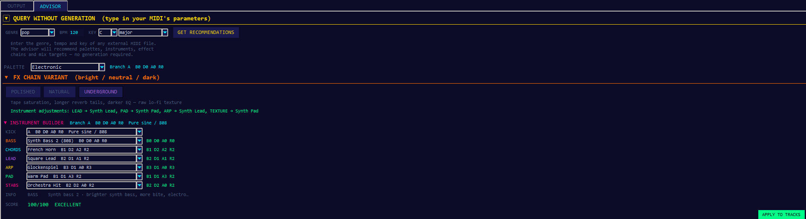
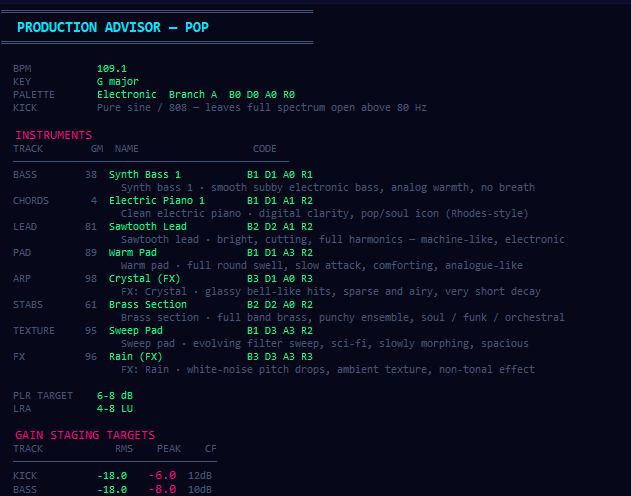

# Music Architect V7

An AI-powered MIDI composition engine that generates full 10-track instrumentals using an **evolutionary fitness loop**. The system evolves beat quality across multiple generations — each generation seeds the next from the top-scoring tracks — until it produces commercially ready music.


---

## What it does

Music Architect V7 generates complete MIDI productions for **11 genres** (Pop, Trap, Hip-Hop, House, EDM, Cinematic, J-Pop, Phonk, Techno, DnB, Classical) through a 3-stage pipeline:

1. **Generate** — Compose 10-track instrumentals (kick, bass, chords, melody, arp, pads, stabs, FX, percussion, intro) using genre-specific cipher rules and humanization.
2. **Grade** — Score each track against a 115-point fitness function covering harmonic correctness, rhythmic density, motif variety, macro-dynamics, and polyrhythmic integrity.
3. **Evolve** — Keep the top 20 % as "golden seeds", mutate them slightly, and use them as the starting point for the next generation.

After 3 generations the best tracks automatically receive a `vocal_ready` sibling — the same arrangement with open chord voicings (root + 5th + octave shell) and the vocal frequency register (C4–C6) cleared in verse, chorus, and hook sections, ready for a vocalist to record over.

The **Production Advisor** tab closes the creative loop: after generating, the user can select instruments from a psychoacoustic compatibility matrix, audition the full beat in a different SoundFont, choose a timbral variant (BRIGHT / NEUTRAL / DARK), and export a printable 10-section PDF production guide — all without leaving the app.

The **Groove & Mixer** panel exposes a per-track mixing and groove-processing layer on top of the composition engine. Each of the 10 tracks has a strip with a always-visible gain fader and pan slider in the header, Tier-1 deterministic controls (transpose, velocity curve, swing, nudge), and Tier-2 seeded humanisation (velocity jitter, timing jitter, random seed). Switching to **Advanced Mode** replaces the simplified controls with four 16-step raw grid editors — one each for velocity multiplier (V), timing offset (T), pan (P), and expression CC11 (E). A genre preset loads theory-correct defaults for all 10 tracks in one click.

The **Piano Roll** tab renders the full composition as a scrollable, color-coded note grid immediately after generation. Track isolation toggles let the user inspect any single instrument line in isolation — useful both for verifying harmonic content and for thesis presentations.

The **Solo Preview** system inside Groove & Mixer lets the user listen to each of the 10 instrument tracks in isolation. A single **Render All Solos** click renders all tracks silently in the background; each strip's waveform thumbnail appears as it completes. Clicking the strip's play button starts playback; clicking anywhere on the waveform thumbnail seeks to that position.

---

## Key Features

| Feature | Details |
|---|---|
| **Evolutionary loop** | Gen 1 → Gen 2 → Gen 3, each seeded from top 20 % of the previous |
| **10-track matrix** | Kick · Bass · Chords · Melody · Arp · Pads · Stabs · FX · Percussion · Intro |
| **Dual output mode** | GUI generates both a Full Beat and a Vocal-Ready Beat in a single press — independently selectable via checkboxes; same seed guarantees a perfectly paired set |
| **Vocal-Ready processing** | `vocal_mask=True` applies open chord voicings, clears C4–C6 in melody/arp/bass/texture tracks at verse/chorus/hook sections; mathematically validated in `vocal_mask_math.py` |
| **Multi-SF2 genre routing** | `SoundFontLibrary` auto-discovers installed SF2s and routes each genre to the optimal timbre: Fluid R3 GM (trap/hip-hop/techno/dnb/phonk), GeneralUser GS (pop/j-pop/edm/house), Arachno SF v1.0 (cinematic/classical) |
| **Non-realtime WAV rendering** | FluidSynth renders via `-a null` driver — no speaker output during export, CPU-speed rendering (~15–20 s for a 3-minute song); subprocess is cancellable via the Stop button |
| **SF2 indicator** | Genre selector shows the active soundfont for the current genre in real time |
| **Procedural song structure** | `StructureGenerator` builds a randomised but music-theory-valid section sequence per genre — verse-chorus arches, build-drop duality, J-pop pre-chorus law |
| **Gradual intro orchestration** | `GradualOrchestrationProtocol` layers instruments in one by one at genre-specific thresholds with a velocity ramp — bass, then kick, then hi-hat, then pad |
| **Gradual outro de-orchestration** | `GradualDeOrchestrationProtocol` exits elements in the reverse intro order (Reverse Principle / arch form) with a two-stage velocity fade |
| **Section-aware drum routing** | `DrumPatternArchitect` selects different base patterns for verse vs chorus/drop — guaranteeing audible groove contrast — with a per-song snare variation level (0–3) |
| **8–9 drum patterns per genre** | Each pattern represents a distinct production school with documented music-theory grounding (boom-bap, Dilla, west coast, drill, half-time, rage, bounce, …) |
| **BassArchitect** | Per-song bass instrument + 16-step rhythmic archetype + note palette selection; 17–18 archetypes for Pop, Hip-Hop, Cinematic; isolated RNG per song |
| **BillboardIntroMatrix** | 4 commercially proven intro archetypes: `pedal_point`, `syncopated_anticipation`, `four_chord_loop`, `inverted_filter_sweep` |
| **Harmonic Governor** | Resolves dissonant notes to the nearest scale pitch; configurable per genre |
| **Bright-scale enforcement** | Commercial pipeline locks Pop/House/EDM to Major, Lydian, Mixolydian, Pentatonic Major — zero dark modes |
| **Velocity LSB watermarking** | Hides a per-file cryptographic fingerprint in note velocities (±1 delta, inaudible) |
| **Vocal synth export** | Melody track exported as `.ustx` for OpenUTAU vocal synthesis; auto-selects the vocal-ready MIDI as the scaffold source |
| **Vocal-Ready WAV export** | Dedicated SAVE WAV button for the vocal-ready beat — renders the instrumental scaffold via FluidSynth so producers can send a high-quality audio reference to their vocalist |
| **Production Advisor tab** | Full post-generation advisor: instrument picker, FX variant selector, preview player, and one-click PDF export |
| **BDRA psychoacoustic scoring** | `BDRARules` scores any instrument combination 0-100 across four timbral axes (Brightness · Density · Attack · Register) and five spectral principles (P1-P5); drives the InstrumentBuilder comboboxes |
| **FX variant system** | `FxChainSelector` merges three independent delta layers — palette_delta → variant_delta → instrument_delta — to produce a final per-track effect chain without modifying the source JSON |
| **Custom SoundFont picker** | `SoundFontPickerWidget` lets the user browse to any `.sf2` on disk; selection persists across sessions via `data/user_sf_override.json`; falls back to genre-routing if the file is moved |
| **PDF production guide** | `AdvisorPDFExporter` generates a 10-section printable A4 PDF: palette, instruments (GM table), BPM targets, gain staging, effect chains, frequency allocation, parallel compression, M/S mastering; falls back to UTF-8 TXT if fpdf2 is absent |
| **GM sound descriptions** | `gm_descriptions.py` supplies one-line sound-character strings for all 128 General MIDI programs; shown in the PDF instrument table and the InstrumentBuilder tooltip |
| **Groove & Mixer panel** | 10-track per-strip mixing with always-visible gain fader and pan slider in each strip header; Tier-1 deterministic controls (transpose, vel curve, swing, nudge) + Tier-2 seeded humanisation; genre presets load theory-correct defaults; [Reset All → Identity] bypasses all processing in one click |
| **Advanced Groove Mode** | Per-strip [ADVANCED ▸] toggle replaces simplified controls with four 16-step raw grids (V · T · P · E); jazz notation step labels (1, 1e, 1+, 1a … 4a); Ctrl+click resets a single step; [Export Grid JSON] saves all four arrays for corpus analysis or ML input |
| **V/T/P/E grid editors** | V = velocity multiplier (0.0–2.0, neutral 1.0); T = timing offset ms (−50 to +50, neutral 0); P = pan per step (−63 L to +63 R, neutral 0); E = expression CC11 per step (0–127, neutral 64); injected as per-note CC10/CC11 events during MIDI processing |
| **Lossless Advanced↔Simple conversion** | Switching back from Advanced to Simple warns the user if the current grids cannot be expressed exactly by the Tier-1 simplified controls; the nearest-equivalent curve and nudge values are offered as a fallback |
| **Solo preview** | Each strip has an **S** button that renders the track in isolation and plays it back. **Render All Solos** renders all 10 tracks sequentially in the background; each waveform thumbnail appears as it completes. Clicking anywhere on a thumbnail seeks to that position. All solos use a neutral default timbre (program 0 melodic, natural drum synthesis) — a note-content preview, not a sound-quality preview. **Reset Solos** clears the cache; solos are also auto-reset on every new generation |
| **Piano Roll tab** | Tab 3 in the right-panel notebook. Renders the full composition as a scrollable color-coded note grid (MIDI notes 21–108, velocity-tinted rectangles, bar markers, piano keyboard strip). Track isolation toggles above the canvas let the user show/hide any combination of the 10 tracks independently. Always displayed below the persistent waveform widget so audio + notes are visible simultaneously |
| **Waveform renderer** | Bar chart waveform blends 65 % peak + 35 % RMS with perceptual gamma 0.55 — quiet passages remain visible against mastered audio; 800-bar minimum resolution avoids the flat-waveform problem on first load |
| **PCM decoder** | `pcm_decoder.py` provides a NumPy-vectorised path with correct 24-bit sign extension and 32-bit IEEE-float support, plus a pure-stdlib fallback for NumPy-free environments |
| **Soft-clip normalisation** | Master buffer is only scaled down when the peak exceeds 0.85 — never boosted. This preserves per-track gain adjustments made in the Groove & Mixer so volume faders have audible effect |
| **Stereo output pipeline** | Every track is rendered to a mono buffer, then placed in the stereo field via constant-power (quarter-circle) panning. Pad, texture, and lead additionally pass through `ChorusWidener` — an anti-phase LFO chorus that creates audible width while remaining mono-compatible. The FX chain and sidechain processor each operate on independent L/R state instances to avoid reverb-tail cross-contamination. Final output is 24-bit stereo WAV |
| **CompositionGroover** | Applies swing, timing nudge, velocity curves, and seeded humanisation to the built-in Python synth path — not just MIDI. Previously groove settings only affected FluidSynth re-renders; `CompositionGroover.apply()` now transforms the composition dict before synthesis so the Python path produces the same rhythmic feel as the MIDI path |
| **Timbre Editor** | Per-instrument synthesis preset panel in the ADVISOR tab. Four roles — kick, snare, hi-hat, melodic — each have a preset combobox and fine-tuning sliders (kick: pitch_end_hz / noise_amount / decay_ms; snare: tuning_st / snare_ratio / decay_ms; hi-hat: brightness / decay_ms; melodic: attack_ms / brightness / drive). Parameters are injected into the built-in synthesiser before every WAV render; C++ and FluidSynth paths are unaffected |
| **Sample Assignment panel** | Collapsible panel in the ADVISOR tab for per-track audio file assignment. One row per track; each row has Browse / Preview / Clear buttons. When a sample is assigned the `SamplePlayer` replaces the built-in synthesiser for that track. Supported formats: WAV · AIFF · FLAC · OGG · MP3 |
| **Original WAV preservation** | The Play Full Beat button is pinned to `_original_wav_path` — set once per generation and never overwritten by groove re-renders or advisor previews. Re-renders and advisor previews update `current_wav_path` independently, so the showcase button always presents the AI's unmodified output |
| **GUI** | Tkinter interface with AI prompt decoder, live SF2 indicator, dual beat/vocal-ready generation, FluidSynth WAV preview, Piano Roll tab, Solo preview, Groove & Mixer panel, Timbre Editor, Sample Assignment panel, and full Production Advisor tab. All advisor sub-sections start collapsed for a clean initial view |

---

## Project Structure

```
music_architect_v7/
├── main.py                        # Entry point — GUI, batch, watermark
├── requirements.txt
├── config/
│   └── harmonic_governor.json     # Scale-correction rules per genre
├── scripts/                       # Standalone utility scripts
│   ├── compare_generations.py
│   ├── inspect_full.py
│   └── ...
├── seeds/
│   └── matrices/                  # Compact golden-matrix JSONs per genre
├── src/
│   ├── composition/               # Core engine — config, cipher, archetypes
│   │   ├── composition_engine.py  # Main CompositionEngine class
│   │   ├── composition_config.py  # CompositionConfig dataclass (vocal_mask flag)
│   │   ├── genre_constants.py     # BPM, scale, drum patterns, instrument maps (11 genres)
│   │   ├── structure_generator.py # Procedural randomised song structure per genre
│   │   ├── bass_architect.py      # Per-song bass archetype + palette selection
│   │   ├── bdra_rules.py          # BDRA 4-axis psychoacoustic scoring + P1-P5 validation
│   │   ├── fx_chain_selector.py   # 3-layer FX delta merger (palette → variant → instrument)
│   │   ├── gm_descriptions.py     # Sound-character strings for all 128 GM programs
│   │   └── billboard/             # Commercially grounded composition modules
│   │       ├── gradual_orchestration.py      # Intro layer entry protocol
│   │       ├── gradual_de_orchestration.py   # Outro reverse-exit protocol
│   │       ├── drum_pattern_architect.py     # Per-section drum pattern routing
│   │       ├── pedal_point.py
│   │       ├── syncopated_anticipation.py
│   │       ├── four_chord_loop.py
│   │       └── inverted_filter_sweep.py
│   ├── generators/                # Per-track note generators (bass, melody, arp, …)
│   ├── orchestration/             # Batch commander + fitness grader
│   ├── pipeline/                  # Batch runners
│   │   ├── omni_render.py         # Evolutionary pipeline (Trap / Hip-Hop)
│   │   └── batch_commercial.py    # Commercial sync pipeline (Pop / House / EDM)
│   ├── tools/
│   │   └── watermark_engine.py    # Dual-layer MIDI watermarking
│   ├── arrangement/               # Genre fusion and smart arrangement
│   ├── export/
│   │   ├── advisor_pdf.py         # 10-section A4 PDF / TXT production guide
│   │   └── utau_bridge.py         # OpenUTAU .ustx vocal project scaffold export
│   ├── rendering/                 # WAV + FluidSynth export
│   │   ├── fluidsynth_renderer.py # Non-realtime FluidSynth renderer with cancel()
│   │   ├── builtin_synthesizer.py # Additive software synth (C++ fast path + Python fallback; stereo out)
│   │   ├── composition_groover.py # CompositionGroover — applies groove to composition dict before synthesis
│   │   ├── timbre_presets.py      # Per-role synthesis presets (kick / snare / hihat / melodic)
│   │   └── soundfont_library.py   # SF2 discovery + genre-based routing (3-font split)
│   ├── ingestion/                 # MIDI seed ingestion and analysis
│   ├── patterns/                  # Euclidean patterns, extractors, generators
│   ├── core/                      # Orchestrator, quantizer, context manager
│   ├── utils/                     # Humanizer, voice-leading, polyrhythm engine
│   │   └── vocal_mask_math.py     # Open voicing + vocal register math (C4–C6)
│   ├── audio/
│   │   ├── pcm_decoder.py         # NumPy-vectorised + stdlib-fallback PCM decoder (8/16/24/32-bit)
│   │   ├── waveform_generator.py  # Peak+RMS blend with perceptual gamma → bar chart amplitudes
│   │   ├── sidechain_processor.py # Kick-triggered sidechain gain reduction
│   │   ├── stereo_panner.py       # Constant-power (quarter-circle) per-track panning + TRACK_PAN table
│   │   └── chorus_widener.py      # Anti-phase LFO chorus widener for pad / texture / lead (mono-compatible)
│   ├── midi/
│   │   ├── groove_settings.py     # TrackGrooveSettings / SongGrooveSettings dataclasses + is_identity()
│   │   ├── groove_presets.py      # GroovePresetLibrary — theory-correct Tier-1 defaults per genre
│   │   ├── groove_processor.py    # GrooveProcessor — applies V/T/P/E grids and CC injection to MIDI
│   │   └── grid_to_preset.py      # VEL_CURVE_GRIDS · grids_to_simple() lossless-conversion check
│   └── gui/                       # Tkinter GUI application
│       ├── app.py                 # Main application window
│       ├── advisor_actions.py     # Advisor action strip (preview / save WAV / MIDI / PDF)
│       ├── advisor_query_panel.py # Query panel: load advisor for external MIDI by genre/BPM/key
│       ├── instrument_builder.py  # InstrumentBuilder — BDRA-filtered combinatoric picker
│       ├── fx_variant_panel.py    # BRIGHT / NEUTRAL / DARK variant switcher
│       ├── soundfont_picker.py    # Custom SF2 file picker with session persistence
│       ├── midi_preview_player.py # WAV + MIDI playback with seek support (pygame)
│       ├── mixer_panel.py         # Groove & Mixer panel — genre preset, feel presets, solo batch, 10 strips
│       ├── mixer_strip.py         # Per-track strip: always-visible gain/pan + Tier-1/2 controls + solo preview
│       ├── timbre_editor_panel.py # Timbre Editor — per-instrument preset combobox + parameter sliders
│       ├── sample_assignment_panel.py # Sample Assignment — per-track audio file override (Browse/Preview/Clear)
│       ├── piano_roll.py          # Read-only piano roll tab — color-coded note grid + track isolation
│       ├── fader_utils.py         # Shared DAW fader math (piecewise-linear dB, unity at 80 %)
│       ├── advanced_groove_view.py# Four-tab V/T/P/E notebook — raw 16-step grid editors
│       ├── step_grid_editor.py    # 16-step vertical slider row with jazz notation labels
│       ├── waveform_widget.py     # Interactive bar-chart waveform with live playhead + seek
│       ├── collapsible_section.py # Reusable collapsible panel widget
│       └── styles.py              # App-wide colour and font constants
└── tests/
```

---

## Installation

```bash
git clone https://github.com/JulianWIAI/music_architect_v7.git
cd music_architect_v7
pip install -r requirements.txt
```

For audio preview inside the GUI (optional):
```bash
pip install pygame
```

### SoundFonts (optional — required for WAV rendering)

Install [FluidSynth](https://www.fluidsynth.org/) and place SF2 files in `C:\SoundFonts\`. The renderer auto-discovers installed fonts and routes each genre to the best available timbre:

| SoundFont | Genres | License |
|---|---|---|
| `FluidR3_GM.sf2` | Trap · Hip-Hop · Phonk · Techno · DnB | MIT |
| `GeneralUser GS v1.472.sf2` | Pop · J-Pop · EDM · House | Free (S. Christian Collins) |
| `Arachno SoundFont - Version 1.0.sf2` | Cinematic · Classical | Verify before commercial use |

The system falls back to whichever font is available, so partial installations still render audio.

---

## Usage

### GUI
```bash
python main.py
```

Select a genre — the SF2 indicator below the genre buttons shows which soundfont will be used. Check **Full Beat** and/or **Vocal-Ready Beat** before clicking Generate. Both are selected by default, producing a paired MIDI set from the same seed in a single generation pass.

### Evolutionary batch — Trap & Hip-Hop
Runs a 3-generation pipeline: Gen1 (100 tracks) → Gen2 (250) → Gen3 (500), then generates `vocal_mask=True` siblings for all tracks above the fitness floor.
```bash
python main.py batch evolutionary --out-dir ./production_run
```

### Commercial sync batch — Pop, House & EDM
Same 3-generation structure, but restricted to bright scales only (Major, Lydian, Mixolydian). All dark/minor modes are excluded at the harmonic level.
```bash
python main.py batch commercial --out-dir ./commercial_run
python main.py batch commercial --skip-to-gen 3   # resume from Gen 3
```

### Watermark the catalog
Applies a dual-layer watermark to every `.mid` file in the output folders and saves the results to `Watermarked_Catalog/`.
```bash
python main.py watermark
python main.py watermark --extract Watermarked_Catalog/pop/track_001.mid
```

---

## Vocal-Ready Mode

When `vocal_mask=True` is active the following changes are applied relative to the full beat:

| Track | Transformation |
|---|---|
| Chords | Open voicing: root + 5th + octave shell (3rd dropped to clear mid-register) |
| Melody | Notes in C4–C6 removed in verse / chorus / hook sections |
| Arp | Notes in C4–C6 removed in verse / chorus / hook sections |
| Bass | Upper octave excursions above C3 trimmed in vocal sections |
| Texture / Pads | Density reduced in the vocal register |

The seed is identical to the full beat, so the two files are structurally and harmonically paired — the vocal-ready version is a true instrumental backing track, not a separate composition.

---

## Production Advisor

The **ADVISOR** tab is a self-contained production assistant that works both with songs you generate inside the app and with any external MIDI file (just enter genre, BPM, and key).





### Panels

| Panel | Purpose |
|---|---|
| **Advisor Query** | Enter genre / BPM / key for an external MIDI and load the full advisor recommendations without running the composition engine |
| **InstrumentBuilder** | Combinatoric picker for all 10 tracks; comboboxes are filtered live to only show instruments that are branch-compliant with the selected kick drum |
| **FxVariantPanel** | Toggle between BRIGHT / NEUTRAL / DARK timbral flavours; genre-specific names (e.g. Pop → POLISHED / NATURAL / UNDERGROUND) |
| **SoundFontPicker** | Browse to any `.sf2` on disk; label turns green when the file is found, orange when it is missing; last choice is restored on next startup |

### BDRA Compatibility Score

Every instrument selection is scored 0-100 by `BDRARules` using four timbral axes:

| Axis | Range | Meaning |
|---|---|---|
| **B** — Brightness | 0-3 | Spectral centroid proxy (0 = sub/dark, 3 = sparkle / air shelf) |
| **D** — Density | 0-3 | Voice count / texture thickness (0 = single sine, 3 = dense ensemble) |
| **A** — Attack | 0-3 | Envelope onset (0 = click/pluck <5 ms, 3 = slow swell >100 ms) |
| **R** — Register | 0-3 | Fundamental pitch range (0 = sub bass, 3 = treble/air) |

Five psychoacoustic principles (P1-P5) validate the combination:
- **P1** Sub-bass exclusivity — at most one track may sit in the critical band below 80 Hz
- **P2** Register monotonicity — successive roles must occupy ascending spectral layers
- **P3** Attack contrast — adjacent voices require envelope differentiation
- **P4** Density headroom — total simultaneous voice density must not exceed perceptual masking threshold
- **P5** Timbral complementarity — kick and bass branch must share a compatible harmonic profile

### FX Delta Layers

`FxChainSelector` builds the final effect chain by merging three independent layers in order:

```
palette_delta   (palette JSON — base genre-level adjustments)
    ↓
variant_delta   (BRIGHT / NEUTRAL / DARK — e.g. +air shelf, +tape saturation)
    ↓
instrument_delta (GM program-aware — e.g. electric piano → tube saturation, choir → mono delay)
    ↓
final per-track effect chain shown in advisor + PDF
```

### Action Strip

After adjusting instruments and variant, the action strip provides four one-click exports:

| Button | Enabled | Produces |
|---|---|---|
| **▶ PREVIEW WITH INSTRUMENTS** | Always (once a song is loaded) | Re-composes with pinned seed, renders WAV via FluidSynth using the selected SF2, auto-plays |
| **⬇ SAVE WAV** | After successful FluidSynth render | WAV of the full beat rendered with the chosen SoundFont and BDRA instruments |
| **⬇ STANDARD MIDI** | As soon as MIDI is written (before WAV render) | Full-beat MIDI with all program_change events for the selected instruments embedded |
| **⬇ VOCAL MIDI** | When "Vocal-Ready" checkbox is on | Vocal-ready scaffold with `vocal_mask=True` and the selected instruments |
| **⬇ EXPORT PDF** | Always | 10-section A4 production guide (see below) |

### PDF Production Guide

`AdvisorPDFExporter` writes a printable A4 PDF with ten sections:

1. **Title block** — genre, BPM, key, date
2. **Palette & FX Variant** — active palette name, branch, kick code, variant label
3. **Instruments** — GM table with program number, sound name, BDRA code, and sound-character description
4. **BPM Targets** — bucket, anchor BPM, allowed key families, PLR target, LRA
5. **Gain Staging** — per-track RMS / peak / crest factor targets (genre-adjusted delta)
6. **Effect Chains** — base chain with merged variant + instrument deltas annotated (adjust / bypass / swap / add)
7. **Frequency Allocation** — HPF / LPF / dominant zone / stereo width per track
8. **Parallel Compression** — New York compression wet blend, ratio, threshold, release
9. **M/S Mastering** — side HPF, side shelf, resulting width
10. Page footer on every page

If `fpdf2` is not installed the exporter falls back to a UTF-8 formatted `.txt` file automatically — the workflow is never blocked.

---

## Groove & Mixer

The **GROOVE & MIXER** collapsible panel in the ADVISOR tab applies post-composition groove processing to the generated MIDI before FluidSynth renders the WAV.

### Track Strips

Each of the 10 tracks has a `TrackMixerStrip`. The strip header is always visible and shows the gain fader and pan slider so the user never needs to expand a strip just to adjust volume — matching standard DAW channel-strip behaviour.

**Header (always visible)**

| Control | Range | Effect |
|---|---|---|
| Gain fader | −∞ to +6 dB | Track output volume; unity (0 dB) at 80 % of slider travel; double-click to reset |
| Pan slider | −63 L to +63 R | Stereo placement written as MIDI CC10 at track start; double-click to centre |

**Tier 1 — Deterministic (expanded)**

| Control | Range | Effect |
|---|---|---|
| Transpose | −24 to +24 semitones | Shifts all notes on the track |
| Velocity curve | flat · accent_1 · accent_1_3 · crescendo · decrescendo | Per-step velocity multiplier pattern |
| Velocity min / max | 1 – 127 | Hard velocity floor and ceiling |
| Swing | 50 – 66 % | Off-beat step delay (50 % = no swing, 66 % = full triplet shuffle) |
| Timing nudge | −50 to +50 ms | Uniform offset applied to every note on the track |

**Tier 2 — Seeded humanisation (expanded)**

| Control | Effect |
|---|---|
| Velocity jitter | Random ± scatter added to each note velocity |
| Timing jitter | Random ± scatter in ms added to each note onset |
| Seed | Locks the RNG for reproducible humanisation across renders; [Roll] generates a random seed; [Clear] restores fresh variation per render |

### Advanced Mode

Clicking **[ADVANCED ▸]** on any strip replaces the simplified Tier-1 controls with four 16-step raw grid editors:

| Grid | Range | Neutral | What it controls |
|---|---|---|---|
| **V** — Velocity | 0.0 – 2.0× | 1.0 | Per-step velocity multiplier — overrides vel_curve |
| **T** — Timing | −50 to +50 ms | 0.0 | Per-step timing offset — overrides swing + nudge |
| **P** — Pan | −63 L to +63 R | 0 | Per-step stereo placement injected as CC10 |
| **E** — Expression | 0 – 127 | 64 | Per-step CC11 expression envelope |

Each grid uses jazz/drum-rudiment notation for the 16 16th-note positions (`1  1e  1+  1a  2  2e  2+  2a  …  4a`). Hover over a slider to see its current value; Ctrl+click resets a single step to neutral; **[Reset all]** resets the whole grid.

Switching back from Advanced to Simple checks whether the current grids are losslessly expressible by the Tier-1 controls. If not, the app warns the user and offers the nearest approximation.

**[Export Grid JSON]** saves all four arrays for the current track as a JSON file — useful for corpus analysis, machine learning, or import into a third-party tool.

### Solo Preview

Each strip has a dedicated solo preview system independent of the main mix render:

| Control | Behaviour |
|---|---|
| **S** button | First click renders the track in isolation and plays it. Shows `···` while rendering, `■` while playing, `▶` when ready to replay |
| **Waveform thumbnail** | 120 px wide canvas drawn in the track's accent color once the render completes. A white playhead line sweeps across during playback |
| **Click on waveform** | Seeks to the clicked position in the solo audio |
| **▶ RENDER ALL SOLOS** | Renders all 10 tracks sequentially in a single background thread. Each strip's waveform fills in as it completes. Nothing plays automatically — the user chooses when to listen |
| **✕ RESET SOLOS** | Clears all cached solo renders. Solo cache is also auto-cleared every time a new composition is generated |

Solo renders always use a **neutral default timbre** (program 0 for all melodic tracks, natural kick/snare/hihat synthesis for drums). This makes the solo an unambiguous note-content preview — rhythm, phrasing, and harmony — not a sound-quality preview. The final export through FluidSynth with a SoundFont will sound substantially richer.

### Preset & Reset

| Button | Effect |
|---|---|
| **[Load Preset]** | Fills all 10 strips with theory-correct Tier-1 defaults for the selected genre + feel; Tier-2 humanisation values are preserved |
| **[Reset All]** | Returns every strip to identity — no velocity scaling, no swing, no nudge, no pan offset; MIDI output is unchanged (DAW "bypass" equivalent) |
| **[APPLY GROOVE & RE-RENDER]** | Applies current groove settings to the **original** composition (not the last re-render) and re-renders audio without recomposing. Groove stacking is prevented — each apply always starts from the generation-time snapshot |

### Feel Presets

In addition to the genre base preset, a second **Feel** dropdown offers named production sub-styles per genre. Examples:

| Genre | Feels |
|---|---|
| Hip-Hop | Default · Boom Bap · Lo-Fi Chill · Modern Rap |
| Trap | Default · Dark Memphis · Melodic Trap · Detroit |
| House | Default · Deep · Chicago · Garage |

`NamedGroovePresetLibrary.get_named(genre, feel)` merges the named overrides on top of the base genre defaults so every track always receives sensible values even if the named preset only specifies a subset of tracks.

---

## Stereo Output

Every WAV render (both FluidSynth and built-in Python synth) produces a **24-bit stereo file** through a four-stage pipeline:

```
per-track mono buffer
    ↓
ChorusWidener  (pad / texture / lead only)
    ↓
StereoPanner   (constant-power quarter-circle law)
    ↓
stereo FX chain + sidechain (independent L/R state)
    ↓
24-bit stereo WAV
```

### Pan positions

| Track | Pan | Notes |
|---|---|---|
| Kick | 0.0 (centre) | Sub frequencies anchor the stereo image |
| Bass | 0.0 (centre) | Low-end mono for translation |
| Percussion | −0.10 (slight L) | Snare/hat spread away from kick |
| Lead | −0.15 (slight L) | Melody sits left-of-centre |
| Chords | +0.20 (slight R) | Harmonic content balances melody |
| Pad | 0.0 + chorus | Width from ChorusWidener |
| Arp | +0.25 (R) | Counter-point to lead |
| Stabs | −0.20 (L) | Rhythmic interest on left |
| Texture | 0.0 + chorus | Full-width atmosphere |
| FX | +0.30 (R) | Sound design detail on right |

### ChorusWidener

`ChorusWidener` (pad / texture / lead only) uses two anti-phase LFO delay lines:

- `lfo_L = depth × (1 + sin(phase)) / 2`
- `lfo_R = depth − lfo_L`

Because `lfo_L + lfo_R = depth` at all times the signal collapses cleanly to mono when L and R are summed — standard broadcast safety. Default parameters: `depth_ms=8.0`, `rate_hz=0.45`, `mix=0.45`.

### FX chain stereo safety

`FxChain`, `DspSession`, and `SidechainFollower` all hold internal state (reverb tail, delay buffer, LFO phase). Each channel gets **separate instances** created at render time — processing L then R through the same object would corrupt reverb tails and delay feedback.

---

## Piano Roll

The **PIANO ROLL** tab (Tab 3 in the right-panel notebook) renders the full composition as a read-only scrollable note grid immediately after generation.

### Layout

```
┌─────────────────────────────────────────────────────────┐
│  [DRUMS][BASS][CHORDS][LEAD][PAD][ARP][STABS]…  [All][None] │
├──────┬──────────────────────────────────────────────────┤
│      │  1        2        3        4     (bar markers)  │
│piano │                                                   │
│keys  │  ████  ██  ████████  ██  ████  (note rectangles) │
│strip │                                                   │
├──────┴──────────────────────────────────────────────────┤
│  ◄═══════════════════════════════════════╸  scrollbar   │
└─────────────────────────────────────────────────────────┘
```

The waveform widget is docked **above** the notebook and remains visible on all tabs — when viewing the Piano Roll tab, audio (waveform) and notes (piano roll) are simultaneously visible without any layout switching.

### Features

| Feature | Details |
|---|---|
| **Track toggles** | One colored button per track above the canvas. Active = full track color, inactive = dimmed. [All] and [None] for fast switching. Toggling redraws the canvas instantly |
| **Note rectangles** | Colored by track using the app's accent palette; velocity-tinted (70–100 % brightness) so dynamics are visible without a separate legend; minimum 2 px width for very short hits |
| **Drum brightening** | Drum and percussion notes are rendered 1.35× brighter than their base track color since short hits would otherwise be hard to see against the dark background |
| **Piano keyboard strip** | Fixed left strip (36 px) shows white and black keys; C notes are labelled (C2, C3, C4 …) for pitch orientation |
| **Bar markers** | Numbered bar lines at the top of the canvas; faint beat lines between them |
| **Octave bands** | Alternating dark background bands for black vs white key rows; faint horizontal lines at every C note |
| **Dual scrollbars** | Horizontal (time) and vertical (pitch) scrollbars; mouse wheel scrolls vertically and syncs the keyboard strip |
| **Default scroll position** | On first display the view centers around middle C (MIDI 60) so the most musically active range is immediately visible |
| **Empty state** | Before any composition is generated a placeholder message is shown; the piano keyboard strip is still drawn |

---

## Fitness Scoring (0 – 115 pts)

| Component | Max pts | What is measured |
|---|---|---|
| Base score | 100 | Scale errors, rhythm density, note range, motif repetition |
| God Mode bonus | +15 | Macro-dynamics, polyrhythmic integrity, humanization delta |

Tracks below 45.0 are discarded after each generation. The survivors become the golden seed pool for the next generation.

---

## Watermarking

Two independent layers protect every file in the catalog:

- **Layer 1 — MetaMessage header**: A hidden track containing `copyright` and `text` MetaMessages with a catalog tag and a SHA-256 filename hash.
- **Layer 2 — Velocity LSB steganography**: A 12-byte payload (4-byte magic + 8-byte per-file fingerprint) encoded into the least-significant bits of note velocities. Maximum audible impact: ±1 velocity unit.

```bash
python main.py watermark --extract path/to/track.mid
```
```
[Layer 1]  copyright : (C) 2026 MUSIC_ARCHITECT_V7 - AUTHORIZED_COMMERCIAL_SYNC_ASSET_CLASS_A
[Layer 2]  magic     : b'MA7\x00'  ✓ VALID
           hash match : ✓ VERIFIED — filename matches embedded hash
```

---

## Tech Stack

- **Python 3.10+**
- `mido` — MIDI file I/O and MetaMessage injection
- `MIDIUtil` — MIDI event generation
- `tkinter` — GUI
- `numpy` — PCM decoding, waveform generation, solo peak computation
- `pygame` — optional audio preview and seek
- `FluidSynth` — optional non-realtime WAV rendering (via `-a null` driver)
- `soundfile` — WAV I/O (24-bit **stereo** output; falls back to stdlib `wave` at 16-bit mono if absent)
- `fpdf2` — optional PDF export for the production guide (falls back to `.txt` if absent)
- `librosa` / `pydub` — optional: used by `SamplePlayer` for audio file decoding (WAV · AIFF · FLAC · OGG · MP3)
